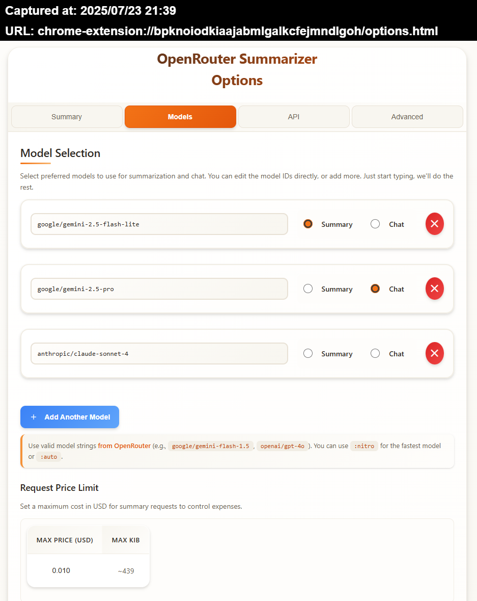

# OpenRouter Summarizer v3.4

**Summarize any web page content and chat with the context using OpenRouter.ai APIs**
_Featuring interactive chat, reliable HTML summaries, flexible options, and chat export!_

---

## ✨ What's New

*   **Immediate Save on Model and Bullet Point Selection:** Options are now saved immediately when selecting models for summary or chat, and when changing the number of bullet points.
*   **Auto-Save Options After API Key Entry:** Settings are now automatically saved after a successful API key entry.
*   **Separate default prompts for popup/chat:** by popular demand, check options!
*   **Optimized COPY button for sharing:** now it returns proper Markdown and the current URL at the end.
*   **Added cost control:** now you can set a maximum price for each summary request. Default/minimum is $0.001, should be enough for most cheaper models.
*   **Added 2Slack button:** Slack is notorioulsy non-compliant with standard Mardkown, so this button is now available.

---

## 🚀 Features

*   **Summarize Anything:** `ALT+hover` to highlight, then `ALT+Click` any element on a web page to select and summarize it.
*   **Interactive Chat:** Engage in follow-up conversations with the LLM based on the summarized content or the original HTML snippet.
*   **Rich Formatting:** Markdown FTW!
*   **Flexible Model Selection:** Choose from a default list or add/edit any OpenRouter-compatible model ID in the Options. Your selection syncs across sessions. Supports `:nitro`, `:floor` and `:auto`.
*   **Configurable Languages for Chat Flags:** Manage a list of preferred languages in the Options. Corresponding flag icons will appear on the chat popup. Clicking a flag initiates a request to translate the last message.
*   **Languages can now be reordered** by dragging them in the Options list.
*   **Customizable Prompt:** Modify the core formatting instructions sent to the LLM via the Advanced Options section.
*   **Configurable Summary:** Choose the approximate number of summary points (3-8) for the initial summary prompt.
*   **Keyboard Shortcuts:** Use `Ctrl/Cmd+Enter` to send messages in the chat window.
*   **Instant Results:** Summaries appear in a clean popup; chat happens in a dedicated tab.
*   **Secure & Private:** Your API key and options are stored locally in your browser storage. Chat context is stored temporarily in session storage. Nothing is sent anywhere except OpenRouter.ai when you request a summary or chat response.
*   **Debug-Friendly:** Enable debug mode in Options for detailed console logging. The API key is filtered from the debug console messages.

---

## Screenshots


***

***

---

## 🛠️ How It Works

1.  **Install & Setup:**
    *   Install the extension.
    *   The Options page opens on first install. Enter your [OpenRouter.ai API Key](https://openrouter.ai/keys).
    *   Review default models/languages/settings. **Save Options**.
2.  **Select Content:**
    *   On any webpage, hold <kbd>ALT</kbd> + Hover to preview highlightable elements (blue dashed outline).
    *   <kbd>ALT</kbd>+Click an element to select it (red solid outline). A floating icon (💡) appears.
3.  **Summarize:**
    *   Click the floating icon (💡), *or* right-click and choose "Send to LLM".
    *   The extension sends the element's HTML and your configured prompt (requesting a JSON array of HTML strings) to the selected OpenRouter model. The prompt now instructs the LLM to determine the language of the input text and summarize in that language.
4.  **Review Summary:**
    *   The summary (received as a JSON array of strings) is parsed and appears in the popup, rendered as a clean HTML list (`<ul><li>...</ul>`). Potential code fences (``````json ... ``````) around the JSON are automatically stripped. LLM responses containing multiple JSON arrays or trailing text are handled more robustly.
    *   **Click the "Chat" button to open the chat tab.**
    *   Use **Copy** or **Close**.
5.  **Chat (Optional):**
    *   Click **Chat** on the summary popup to chat about the summary.
    *   A new browser tab opens. An info banner confirms context is available.
    *   The original HTML snippet and the raw/processed JSON string are stored. For *every* message you send, the original HTML snippet is automatically prepended to the recent chat history before sending to the LLM for context.
    *   **Language flags are now available in the chat interface.** Click a flag to request a translation of the *last assistant message* into that language. **While the LLM is processing a request, these flags will be visually dimmed and show a "busy" tooltip.**
    *   Type follow-up questions. Use `Ctrl+Enter` / `Cmd+Enter` to send.
    *   LLM responses are rendered with via basic HTML (`<b>`/`<i>`) but full markdown is recognized via the `marked` library.
    *   Use **Copy MD**, **Download MD**, or **Download JSON** to save the chat.

---

## 🔒 Privacy & Permissions

*   **Permissions Used:**
    *   `activeTab`, `scripting`: To interact with the page for selection and UI.
    *   `contextMenus`: For the right-click menu option.
    *   `storage`: To save API key/preferences (`sync`) and temporary chat context (`session`).
    *   `<all_urls>`: To allow selection on any website.
    *   **`web_accessible_resources`**: Used for accessing static assets (icons, flags, JS libraries like `marked.min.js`) and dynamically imported content script modules (`highlighter.js`, `floatingIcon.js`, `summaryPopup.js`, `constants.js`) from content scripts/pages.
*   **Your Data:**
    *   **API Key & Settings:** Stored locally in `chrome.storage.sync`. Only sent to OpenRouter.ai upon request. Prompt templates and your configured language list are also stored here.
    *   **Selected HTML & Summary:** Sent to OpenRouter.ai for summary/chat requests.
    *   **Chat Context:** Original HTML snippet and raw/processed JSON string stored temporarily in `chrome.storage.session` for the chat tab. Cleared when the browser session ends. The HTML snippet is re-sent with subsequent chat messages for context.
    *   **No Analytics:** No tracking or ads.
*   **Security:**
    *   Renders HTML list/Markdown. Does **not** execute scripts or load external resources from LLM responses. Relies on `marked` for chat rendering. Static assets like SVGs and dynamically imported JS modules are loaded securely from within the extension bundle via `chrome.runtime.getURL`.

**Q: Why aren't all my configured flags showing in the popup?**
A: The flags have been moved to the chat interface for better organization and to avoid cluttering the summary popup.

**Q: How are flags chosen for languages?**
A: The extension attempts to use an SVG flag file (`[language_code].svg`) from the `country-flags/svg/` directory based on the <a href="https://en.wikipedia.org/wiki/ISO_639-1" target="_blank">ISO 639-1</a> code associated with that language in the `languages.json` file. If a flag file for a specific language code is not available in the extension bundle, a generic placeholder flag will be displayed.

---

## 🏷️ Tags

`Summarizer`, `LLM`, `OpenRouter`, `AI`, `Chat`, `JSON`, `HTML`, `Markdown`, `Chrome Extension`, `Productivity`, `GPT`, `Claude`, `Llama`, `Gemini`, `Article Summarizer`, `Web Clipper`, `Prompt Engineering`, `Translation`, `Language Flags`
