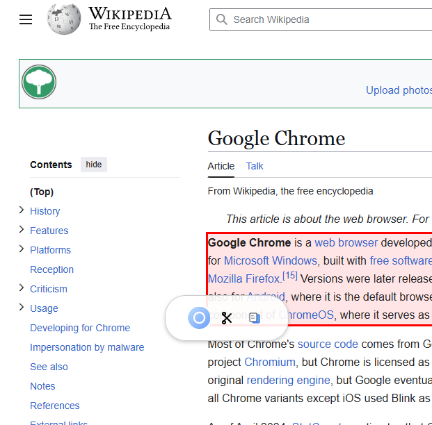
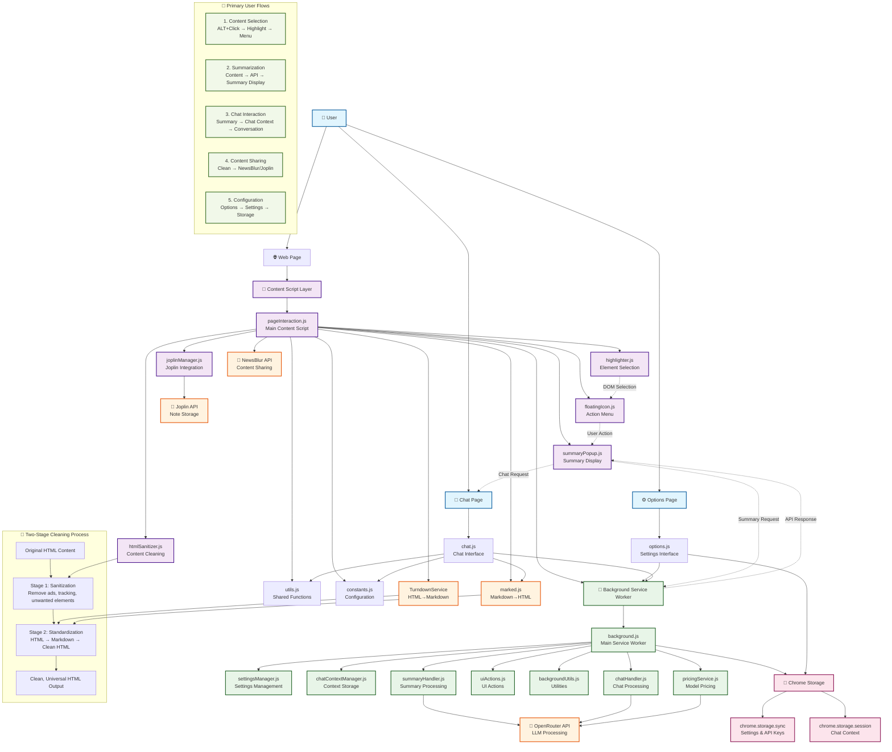

# OpenRouter Summarizer v3.8.6

**Summarize any web page content and chat with the context using OpenRouter.ai APIs**
_Featuring interactive chat, native HTML summaries, flexible options, and comprehensive debug logging!_

---

## What's New in v3.8.6

- **UI/UX Enhancements:**
    - The "Copy" button in the summary popup is now disabled during LLM requests to prevent errors.
    - Button text and hotkeys have been updated for a more intuitive experience:
        - "Chat" is now "Cha[t]" with hotkey `t`.
        - "Close" is now "Clos[e]" with hotkey `e`.
        - "NewsBlur" is now "Newsblu[r]" with hotkey `r`.
        - The "Close" button can now also be activated with the `Escape` key.

---

## Features

- **Summarize Anything:** `ALT+hover` to highlight, then `ALT+Click` any element on a web page to select and summarize it.
- **Native HTML Summaries:** LLM returns properly formatted HTML bullet lists with preserved formatting (bold text, etc.).
- **Copy:** Use Copy HTML icon (📄) in the floating menu to copy complete element HTML to clipboard.
- **Interactive Chat:** Engage in follow-up conversations with the LLM based on the summarized content or the original HTML snippet.
- **Flexible Model Selection:** Choose from a default list or add/edit any OpenRouter-compatible model ID in the Options. Your selection syncs across sessions. Supports `:nitro`, `:floor` and `:auto`.
- **Configurable Languages for Chat Flags:** Manage a list of preferred languages in the Options. Corresponding flag icons will appear on the chat popup. Clicking a flag initiates a request to translate the latest message.
- **Languages can now be reordered** by dragging them in the Options list.
- **Customizable Prompt:** Modify the formatting instructions sent to the LLM via the Advanced Options section.
- **Fully Functional Summary Configuration:** Choose the number of summary points (3-8) - this setting dynamically updates the prompt.
- **Keyboard Shortcuts:**
  - **Summary popup:** `Y` to copy, `T` to chat, `R` for NewsBlur, `E` or `Escape` to close
  - **Joplin dialog:** `Enter` to save, `Escape` to close
  - **Chat window:** `Ctrl/Cmd+Enter` to send messages
- **Instant Results:** Summaries appear in a clean popup; chat happens in a dedicated tab.
- **Secure & Private:** Your API key and options are stored locally in your browser storage. Chat context is stored temporarily in session storage. Nothing is sent anywhere except OpenRouter.ai when you request a summary or chat response.
- **Smart Content Cleanup:** Automatically removes unwanted elements like ads, tracking scripts, navigation menus, social media widgets, and promotional content before processing, ensuring cleaner summaries and better LLM performance.
- **Comprehensive Debug Logging:** Enable debug mode in `Options` for detailed console logging throughout all processes including language detection, summary processing, and API calls. The API key is filtered from debug messages.
- **Joplin support:** Save to Joplin instead of/in addition to summarizing.

---

## Screenshots

## 

---

---

---

## 

---

## Extension Architecture

The OpenRouter Summarizer follows a modular architecture with clear separation of concerns between content scripts, background services, and user interfaces. The diagram below shows all file flows and component interactions:

### Key Components

- **🟦 User Interface Layer**: Direct user interaction points (web pages, options, chat)
- **🟪 Content Scripts**: Injected scripts handling DOM interaction and UI elements
- **🟩 Background Services**: Service worker managing API calls, storage, and business logic
- **🟧 External Services**: Third-party APIs and libraries for LLM processing and integrations
- **🟥 Storage Systems**: Chrome extension storage for settings and temporary data

### Data Flow Highlights

1. **Content Selection**: User interactions trigger DOM highlighting and element selection
2. **Processing Pipeline**: Selected content flows through sanitization, API processing, and display
3. **Two-Stage Cleaning**: Enhanced content cleaning for NewsBlur sharing with sanitization and standardization
4. **Modular Architecture**: Clear separation between UI, business logic, and external integrations

---

## How It Works

1.  **Install & Setup:**
    - Install the extension.
    - The Options page opens on first install. Enter your [OpenRouter.ai API Key](https://openrouter.ai/keys).
    - Review default models/languages/settings. **Save Options**.
2.  **Select Content:**
    - On any webpage, hold <kbd>ALT</kbd> + hover mouse to preview highlightable elements (blue dashed outline).
    - <kbd>ALT</kbd>+Click an element to select it (red solid outline). A floating menu appears with up to 3 icons:
      - **💡 Summarize:** Main summarization icon
      - **✂️ Joplin:** Save to Joplin (if token configured)
      - **📄 Copy HTML:** Copy element's complete HTML to clipboard
3.  **Choose Action:**
    - **Summarize:** Click the main icon (💡), _or_ right-click and choose "Send to LLM".
    - **Copy HTML:** Click the Copy HTML icon (📄) to copy sanitized element HTML to clipboard.
    - **Save to Joplin:** Click the Joplin icon (✂️) to save content to a Joplin notebook.
    - The extension extracts the selected element's HTML, applies comprehensive sanitization to remove unwanted content (ads, tracking, navigation elements), converts it to Markdown to save money and improve LLM's job, then sends it and your configured prompt (requesting a JSON array of HTML strings) to the selected OpenRouter model for summarization.
4.  **Review Summary:**
    - The summary (received as a JSON array of strings) is parsed and appears in the popup, rendered as a clean HTML list (`<ul><li>...</ul>`). Potential code fences (`json ... `) around the JSON are automatically stripped. LLM responses containing multiple JSON arrays or trailing text are handled more robustly.
    - **Use keyboard shortcuts for quick actions:**
      - **Y** - Copy summary to clipboard
      - **T** - Open chat interface (if enabled)
      - **R** - Share to NewsBlur (if token configured)
      - **E** or **Escape** - Close the popup
    - **Or use buttons:** **Copy**, **Chat**, **NewsBlur**, or **Close**.
    - Use **[NewsBlur](https://www.newsblur.com/)** to share the summary and the selected HTML snippet.
5.  **Chat ("talk to the page"):**
    - Click **Chat** on the summary popup to chat about the article.
    - A new browser tab opens. This page has access to both the original HTML snippet and the summary.
    - The original HTML snippet and the raw/processed JSON string are stored. For _every_ message you send, the original HTML snippet is automatically prepended to the recent chat history before sending to the LLM for context.
    - **Language flags are available in the chat interface.** Click a flag to request a translation of the _latest assistant message_ into that language. **While the LLM is processing a request, these flags will be visually dimmed and show a "busy" tooltip.**
    - Type follow-up questions. Use `Ctrl+Enter` / `Cmd+Enter` to send using any of the configured models.
    - LLM responses are rendered with via basic HTML (`<b>`/`<i>`) but full markdown is recognized via the `marked` library.
    - Use **Copy MD**, **Download MD**, or **Download JSON** to save the chat.

---

## Privacy & Permissions

- **Permissions Used:**
  - `activeTab`, `scripting`: To interact with the page for selection and UI.
  - `contextMenus`: For the right-click menu option.
  - `storage`: To save API key/preferences (`sync`) and temporary chat context (`session`).
  - `<all_urls>`: To allow selection on any website.
  - **`web_accessible_resources`**: Used for accessing static assets (icons, flags, JS libraries like `marked.min.js`) and dynamically imported content script modules (`highlighter.js`, `floatingIcon.js`, `summaryPopup.js`, `constants.js`) from content scripts/pages.
- **Your Data:**
  - **API Key & Settings:** Stored locally in `chrome.storage.sync`. Only sent to OpenRouter.ai upon request. Prompt templates and your configured language list are also stored here.
  - **Selected HTML & Summary:** Sent to OpenRouter.ai for summary/chat requests.
  - **Chat Context:** Original HTML snippet and raw/processed JSON string stored temporarily in `chrome.storage.session` for the chat tab. Cleared when the browser session ends. The HTML snippet is re-sent with subsequent chat messages for context.
  - **No Analytics:** No tracking or ads.
- **Security:**
  - Renders HTML list/Markdown. Does **not** execute scripts or load external resources from LLM responses. Relies on `marked` for chat rendering. Static assets like SVGs and dynamically imported JS modules are loaded securely from within the extension bundle via `chrome.runtime.getURL`.

**Q: How are flags chosen for languages?**
A: The extension attempts to use an SVG flag file (`[language_code].svg`) from the `country-flags/svg/` directory based on the <a href="https://en.wikipedia.org/wiki/ISO_639-1" target="_blank">ISO 639-1</a> code associated with that language in the `languages.json` file. If a flag file for a specific language code is not available in the extension bundle, a generic placeholder flag will be displayed.

---

## Tags

`Summarizer`, `LLM`, `OpenRouter`, `AI`, `Chat`, `JSON`, `HTML`, `Markdown`, `Chrome Extension`, `Productivity`, `GPT`, `Claude`, `Llama`, `Gemini`, `Article Summarizer`, `Web Clipper`, `Prompt Engineering`, `Translation`, `Language Flags`, `Keyboard Shortcuts`, `Copy HTML`, `Hotkeys`