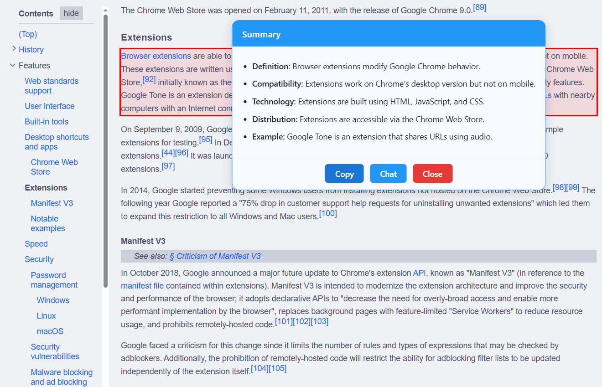
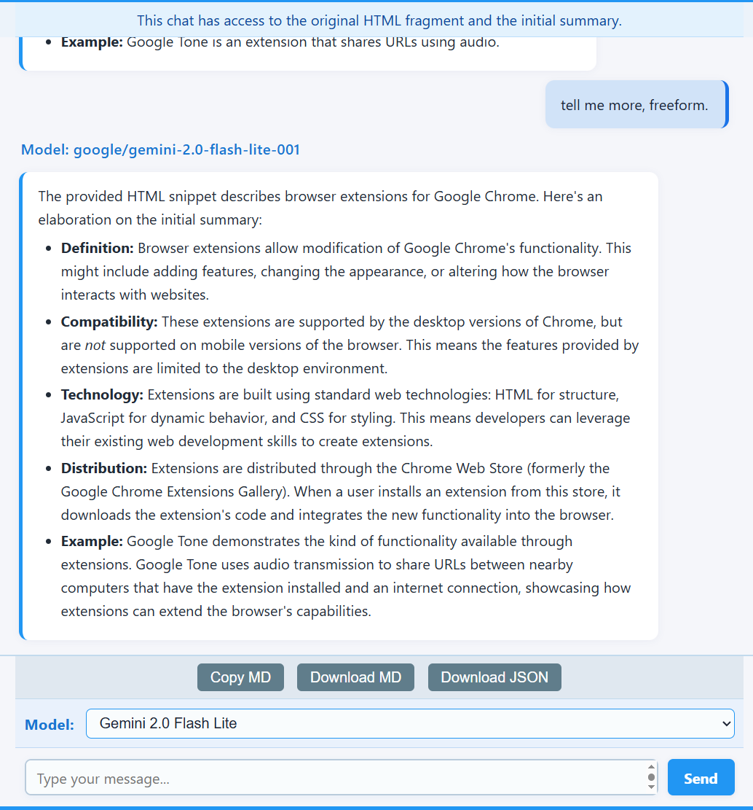

# OpenRouter Summarizer v2.50.7

**Summarize any web page content and chat with the context using OpenRouter.ai APIs**
_Featuring interactive chat, reliable HTML summaries, flexible options, and chat export!_

---

## ✨ What's New Since Version 2.0

*   **v2.50:**
    *   Modified initial summary request prompt to ask for summary in the original text's language instead of the first configured language. (v2.50.7)
    *   Updated summary popup UI: Moved language flags to the footer as buttons, grouped with a default chat icon button under a centered "CHAT" label. (v2.50.6)
    *   Major update, may require options reset.
    *   Updated `options.js` to populate the language list with default languages (English, Spanish, Hebrew, Mandarin Chinese) if it is empty on startup or the last language is deleted by the user.
    *   Centralized LLM API calls in `background.js` for both summary and chat functionalities, simplifying content script logic.
    *   Now you can stop a chat request by clicking the "Stop" button.
    *   Changed the logic for languages: Now the user can set their own languages, with flags, and fast lookup!
    *   The first language is the default for summaries. Others show up in the popup header, can be clicked.
    *   Languages can now be reordered by dragging them in the Options list.


---

## 🚀 Features

*   **Summarize Anything:** `ALT+hover` to highlight, then `ALT+Click` any element on a web page to select and summarize it.
*   **Interactive Chat:** Engage in follow-up conversations with the LLM based on the summarized content and the original HTML snippet (context is now persistent!).
*   **Rich Formatting:**
    *   Initial summaries are rendered in the popup as a clean HTML list (`<ul><li>...</ul>`).
    *   Chat responses support both full Markdown formatting via `marked` and basic HTML (`<b>`).
*   **Flexible Model Selection:** Choose from a default list or add/edit any OpenRouter-compatible model ID in the Options. Your selection syncs across sessions. Supports `:nitro`, `:floor` and `:auto`.
*   **Configurable Languages for Chat Flags:** Manage a list of preferred languages in the Options. Corresponding flag icons will appear on the summary popup. Clicking a flag initiates a chat session requesting translation of the summary into that language.
*   **Languages can now be reordered** by dragging them in the Options list.
*   **Customizable Prompt:** Modify the core formatting instructions sent to the LLM via the Advanced Options section.
*   **Configurable Summary:** Choose the approximate number of summary points (3-8) for the initial summary prompt.
*   **Keyboard Shortcuts:** Use `Ctrl+Enter` / `Cmd+Enter` to send messages in the chat window.
*   **Instant Results:** Summaries appear in a clean popup; chat happens in a dedicated tab.
*   **Secure & Private:** Your API key and options are stored locally in your browser storage. Chat context is stored temporarily in session storage. Nothing is sent anywhere except OpenRouter.ai when you request a summary or chat response.
*   **Debug-Friendly:** Enable debug mode in Options for detailed console logging. The API key is filtered from the debug console messages.

---

## Screenshots





---

## 🛠️ How It Works

1.  **Install & Setup:**
    *   Install the extension.
    *   The Options page opens on first install. Enter your [OpenRouter.ai API Key](https://openrouter.ai/keys).
    *   Review default models/languages/settings. **Save Options**.
2.  **Select Content:**
    *   On any webpage, hold <kbd>ALT</kbd> + Hover to preview highlightable elements (blue dashed outline).
    *   <kbd>ALT</kbd>+Click an element to select it (red solid outline). A floating icon (💡) appears.
3.  **Summarize:**
    *   Click the floating icon (💡), *or* right-click and choose "Send to LLM", *or* click the extension toolbar icon.
    *   The extension sends the element's HTML and your configured prompt (requesting a JSON array of HTML strings) to the selected OpenRouter model. The initial summary is now generated in the **first configured language**.
4.  **Review Summary:**
    *   The summary (received as a JSON array of strings) is parsed and appears in the popup, rendered as a clean HTML list (`<ul><li>...</ul>`). Potential code fences (``````json ... ``````) around the JSON are automatically stripped. LLM responses containing multiple JSON arrays or trailing text are handled more robustly.
    *   **If you have configured preferred languages in Options, corresponding flag icons will appear in the popup header.** Clicking a flag icon will immediately open the Chat tab, requesting a translation of the summary into that language and initiating chat in that language.
    *   Use **Copy** or **Close**.
5.  **Chat (Optional):**
    *   Click **Chat** on the summary popup to chat about the summary in English. **(Or click a flag icon in the popup header to start chat requesting a translation)**.
    *   A new browser tab opens. An info banner confirms context is available.
    *   The original HTML snippet and the raw/processed JSON string are stored. For *every* message you send, the original HTML snippet is automatically prepended to the recent chat history before sending to the LLM for context.
    *   Type follow-up questions. Use `Ctrl+Enter` / `Cmd+Enter` to send.
    *   LLM responses are rendered with via basic HTML (`<b>`/`<i>`) but full markdown is recognized via the `marked` library.
    *   Use **Copy MD**, **Download MD**, or **Download JSON** to save the chat.

---

## 🔒 Privacy & Permissions

*   **Permissions Used:**
    *   `activeTab`, `scripting`: To interact with the page for selection and UI.
    *   `contextMenus`: For the right-click menu option.
    *   `storage`: To save API key/preferences (`sync`) and temporary chat context (`session`).
    *   `<all_urls>`: To allow selection on any website.
    *   **`web_accessible_resources`**: Used for accessing static assets (icons, flags, JS libraries like `marked.min.js`) and dynamically imported content script modules (`highlighter.js`, `floatingIcon.js`, `summaryPopup.js`, `constants.js`) from content scripts/pages.
*   **Your Data:**
    *   **API Key & Settings:** Stored locally in `chrome.storage.sync`. Only sent to OpenRouter.ai upon request. Prompt templates and your configured language list are also stored here.
    *   **Selected HTML & Summary:** Sent to OpenRouter.ai for summary/chat requests.
    *   **Chat Context:** Original HTML snippet and raw/processed JSON string stored temporarily in `chrome.storage.session` for the chat tab. Cleared when the browser session ends. The HTML snippet is re-sent with subsequent chat messages for context.
    *   **No Analytics:** No tracking or ads.
*   **Security:**
    *   Renders HTML list/Markdown. Does **not** execute scripts or load external resources from LLM responses. Relies on `marked` for chat rendering. Static assets like SVGs and dynamically imported JS modules are loaded securely from within the extension bundle via `chrome.runtime.getURL`.

---

## 🧑‍💻 Open Source

This extension is open source, MIT licensed.
[View code or contribute on GitHub](https://github.com/bogorad/openrouter-summarizer) <!-- Update link if needed -->

---

## ❓ FAQ

**Q: Why API key?**
A: Uses OpenRouter.ai API for summaries/chat. Get your own key.

**Q: Why OpenRouter?**
A: Access to many LLMs, good pricing/performance.

**Q: Data safe?**
A: Yes. Key/settings local. Text sent to OpenRouter on request. Chat context uses temporary session storage. See Privacy section.

**Q: How does Chat context work?**
A: The original selected HTML snippet and the raw/processed JSON string are stored when chat starts. For the *first* chat message, both are sent. For *subsequent* messages, the original HTML snippet is automatically prepended to the recent chat history before sending to the LLM to help maintain context.

**Q: Can I mix models?**
A: Yes! The initial summary uses your default model. In the chat tab, you can select a *different* model from the dropdown for each message you send.

**Q: Can I customize models/languages/prompt?**
A: Yes! Options allow editing model/language lists. Advanced Options let you edit the variable part of the prompt.

**Q: Is rendering HTML/Markdown safe?**
A: The initial summary popup renders a basic HTML list based on the JSON array received (LLM is instructed to only use `<b>`/`<i>`). Chat uses the `marked` library for standard Markdown, which can include HTML. While generally safe, be mindful of LLM outputs. No scripts are executed. Flag images are static SVGs loaded securely from within the extension bundle via `chrome.runtime.getURL`.

**Q: Why aren't all my configured flags showing in the popup?**
A: To keep the popup header clean and prevent it from becoming too wide on smaller screens, the popup only displays a limited number (currently up to 4, excluding the first/default language) of your configured languages as flags.

**Q: How are flags chosen for languages?**
A: The extension attempts to use an SVG flag file (`[language_code].svg`) from the `country-flags/svg/` directory based on the <a href="https://en.wikipedia.org/wiki/ISO_639-1" target="_blank">ISO 639-1</a> code associated with that language in the `languages.json` file. If a flag file for a specific language code is not available in the extension bundle, a generic placeholder flag will be displayed.

---

## Technical updates

*   **v2.50:**
    *   Updated `options.js` to force a page update after 300ms when resetting to defaults, ensuring the UI reflects the changes.
    *   Fixed `TypeError` in `chat.js` by ensuring `chatTargetLanguage` is checked for existence before calling `trim()`, preventing errors when the value is `undefined`.
    *   Fixed issue in `chat.js` where the target language for translation was not being recognized due to a property name mismatch, ensuring that clicking on a flag in the summary popup correctly initiates a translation request in the chat tab.
    *   Fixed warning in `background.js` about failed message sending due to closed channels by improving error handling.
    *   Removed debug info from popup display in `pageInteraction.js`, keeping it only in the console logs.
    *   Prevented saving settings in `options.js` while a language selection is in progress to avoid incomplete data storage.
    *   Added full LLM response details, including model and language information, to the summary popup in debug mode in `pageInteraction.js`.
    *   Updated all instances of `languageInfo` to `language_info` across the codebase for consistency in property naming.
    *   Added debug logging in `background.js` to display the complete response JSON, including language information, sent back to the content script for summary requests when debug mode is enabled.
    *   Updated version numbers across all relevant files to maintain consistency as per CONVENTIONS.md guidelines.
    *   Added debug logging in `pageInteraction.js` to display the result of the health check response from `background.js`.
    *   Removed unnecessary warning about missing language data during initialization in `summaryPopup.js` since language data is handled post-LLM response.
    *   Simplified language data structure in `pageInteraction.js` to use a single `availableLanguages` array for rendering flags in the summary popup, ensuring a unified data exchange.
    *   Enhanced validation in `background.js` for `apiKey`, `model`, and `availableLanguages` to ensure correct format during `requestSummary` and `llmChatStream` handlers.
    *   Added post-save verification in `options.js` to fetch and check saved settings, ensuring data integrity and notifying users of discrepancies.
    *   Added robust error handling in `background.js` to prevent uncaught errors when the receiving end (e.g., chat tab) is no longer available, addressing the "Could not establish connection. Receiving end does not exist." error.
    *   Improved JSON parsing in `chat.js` to extract and render JSON arrays from assistant responses as structured HTML lists.
    *   Added structured output requests in `background.js` and `pageInteraction.js` to ensure LLM responses are formatted as JSON arrays with exactly 5 items for summaries and chat interactions.
    *   Updated the version to 2.31 in `manifest.json` and `constants.js`.
    *   Fixed the issue where the "Stop" button remained visible after a successful chat request completion in `chat.js` by adding logic to revert to the "Send" button state.
    *   Resolved the persistence of the "Chat request stopped by user" error message after a new "Send" action by clearing the error display on form submission in `chat.js`.
    *   Updated the version to 2.30 across all relevant files including `manifest.json`, `pageInteraction.js`, `background.js`, `options.js`, `chat.js`, and `constants.js`.
    *   Fixed chat UI rendering issues by adjusting CSS properties and removing unnecessary visibility checks in `chat.js` to ensure messages are displayed correctly regardless of content length or screen size.
    *   Improved error handling by updating form submission logic for Ctrl+Enter in `chat.js`, ensuring reliable message sending even in edge cases.
    *   Enhanced user experience by ensuring consistent UI rendering and interaction across chat and summary popup components, addressing previous visibility and layout issues.
    *   Implemented stop request functionality in `chat.js` and `background.js` to allow users to cancel ongoing chat requests, improving control over long or unwanted responses.
    *   Fixed chat submit issues (Ctrl+Enter and Send button).
    *   Fixed flag positioning in summary popup header.
    *   Improved parsing of initial summary context in chat window.
    *   Added standard version/update headers to JS files.
    *   Major refactoring of the content script (`pageInteraction.js`) into separate modules (`highlighter.js`, `floatingIcon.js`, `summaryPopup.js`) using dynamic imports.
    *   Centralized settings access: `background.js` now handles fetching settings from storage and providing them to other scripts (`pageInteraction.js`, `options.js`, `chat.js`) via message passing.
    *   Improved debug logging consistency and API key sanitization in logs.
    *   Fixed issues related to language data loading and availability in `options.js` and `pageInteraction.js`.
    *   Improved parsing logic in `pageInteraction.js` and `chat.js` to better handle LLM responses containing embedded/multiple JSON structures within surrounding text, even without code fences.
    *   Fixed saving/loading of custom model list (including labels) in Options.
    *   Updated summary popup UI: Moved language flags to the footer as buttons, grouped with a default chat icon button under a centered "CHAT" label. (v2.50.6)
    *   Modified initial summary request prompt to ask for summary in the original text's language instead of the first configured language. (v2.50.7)

*   **v2.10:**
    *   Refactored language handling: Added `languages.json`, dynamic flag display based on configuration, drag-and-drop reordering in Options.
    *   Initial summary now requested in the first configured language.

---

## 🏷️ Tags

`Summarizer`, `LLM`, `OpenRouter`, `AI`, `Chat`, `JSON`, `HTML`, `Markdown`, `Chrome Extension`, `Productivity`, `GPT`, `Claude`, `Llama`, `Gemini`, `Article Summarizer`, `Web Clipper`, `Prompt Engineering`, `Translation`, `Language Flags`
