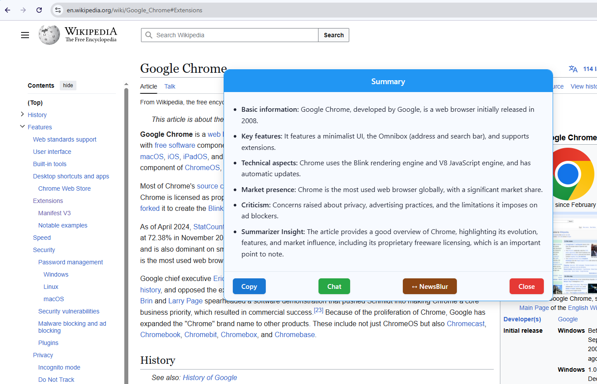

# OpenRouter Summarizer v2.10

**Summarize any web page content and chat with the context using OpenRouter.ai APIs**
_Featuring interactive chat, reliable HTML summaries, flexible options, and chat export!_

---

## ✨ What's New Since Version 2.9

*   **Floating Icon Visibility Fix:** Corrected an issue where the floating icon would disappear prematurely after clicking it to initiate summarization, especially if there were errors loading settings or processing the element. The icon now correctly remains visible while the LLM is processing and is removed only when the final summary or error popup is displayed.
*   **Improved Error Handling:** Enhanced error handling in `popup.js` to ensure the floating icon and selection highlight are removed consistently when errors occur during settings loading or initial element processing, before the LLM request is even sent.
*   Fixed a `ReferenceError` in the floating icon positioning logic in `popup.js`.

---

## 🚀 Features

*   **Summarize Anything:** `ALT+hover` to highlight, then `ALT+Click` any element on a web page to select and summarize with a single icon click.
*   **Interactive Chat:** Engage in follow-up conversations with the LLM based on the summarized content and the original HTML snippet (context is now persistent!).
*   **Rich Formatting:**
    *   Initial summaries (requested as JSON array of HTML strings) are rendered in the popup as a clean HTML list (`<ul><li>...</ul>`).
    *   Chat responses render full Markdown formatting via `marked`.
*   **Flexible Model Selection:** Choose from a default list or add/edit any OpenRouter-compatible model ID in the Options. Your selection syncs across sessions. Supports `:nitro` and `:auto`.
*   **Configurable Languages for Chat Flags:** Manage a list of preferred languages in the Options. Corresponding flag icons will appear on the summary popup. Clicking a flag initiates a chat session requesting translation of the summary into that language. **Languages can now be reordered by dragging them in the Options list.**
*   **Customizable Prompt:** Modify the core formatting instructions sent to the LLM via the Advanced Options section (default now requests JSON/HTML).
*   **Configurable Summary:** Choose the approximate number of summary points (3-8) for the initial summary prompt.
*   **Keyboard Shortcuts:** Use `Ctrl+Enter` / `Cmd+Enter` to send messages in the chat window.
*   **Instant Results:** Summaries appear in a clean popup; chat happens in a dedicated tab.
*   **Secure & Private:** Your API key and options are stored locally in your browser storage. Chat context is stored temporarily in session storage. Nothing is sent anywhere except OpenRouter.ai when you request a summary or chat response.
*   **Debug-Friendly:** Enable debug mode in Options for detailed console logging.

---




---

## 🛠️ How It Works

1.  **Install & Setup:**
    *   Install the extension.
    *   The Options page opens on first install. Enter your [OpenRouter.ai API Key](https://openrouter.ai/keys).
    *   Review default models/languages/settings. **Save Options**.
2.  **Select Content:**
    *   On any webpage, hold <kbd>ALT</kbd> + Hover to preview highlightable elements (blue dashed outline).
    *   <kbd>ALT</kbd>+Click an element to select it (red solid outline). A floating icon (💡) appears.
3.  **Summarize:**
    *   Click the floating icon (💡), *or* right-click and choose "Send to LLM", *or* click the extension toolbar icon.
    *   The extension sends the element's HTML and your configured prompt (requesting a JSON array of HTML strings) to the selected OpenRouter model. The initial summary is now generated in the **first configured language**.
4.  **Review Summary:**
    *   The summary (received as a JSON string) is parsed and appears in the popup, rendered as a clean HTML list (`<ul><li>...</ul>`). Potential code fences (```json ... ```) around the JSON are automatically stripped.
    *   **If you have configured preferred languages in Options, corresponding flag icons will appear in the popup header.** Clicking a flag icon will immediately open the Chat tab, requesting a translation of the summary into that language and initiating chat in that language.
    *   Use **Copy** or **Close**.
5.  **Chat (Optional):**
    *   Click **Chat** on the summary popup to chat about the summary in English. **(Or click a flag icon in the popup header to start chat requesting a translation)**.
    *   A new browser tab opens. An info banner confirms context is available.
    *   The original HTML snippet and the raw JSON string are stored. For *every* message you send, the original HTML snippet is automatically prepended to the recent chat history before sending to the LLM for context.
    *   Type follow-up questions. Use `Ctrl+Enter` / `Cmd+Enter` to send.
    *   LLM responses are rendered with full Markdown.
    *   Use **Copy MD**, **Download MD**, or **Download JSON** to save the chat.

---

## ✨ Formatting: JSON/HTML Summaries & Markdown Chat

*   **Initial Summaries (Popup):** The LLM is asked for a **JSON array** where each element is an HTML string. The prompt instructs the LLM to only use `<b>` and `<i>` tags by default. The extension parses this JSON and renders the array items as an HTML list (`<ul><li>...</ul>`) in the popup. Potential code fences (```json ... ```) around the JSON are automatically stripped. Flag icons representing your configured languages (if any) are also displayed in the popup header, loaded as SVG files from the extension bundle. The flag displayed for a language is based on the <a href="https://en.wikipedia.org/wiki/ISO_639-1" target="_blank">ISO 639-1</a> code associated with that language in the `languages.json` file (e.g., "en" for English maps to `en.svg`). **Note:** Not all language codes have a corresponding country flag SVG in the bundle. In such cases, a generic placeholder flag will be shown.
*   **Chat Responses (Chat Tab):** Rendered using the `marked` library, supporting full GitHub Flavored Markdown including bold, italics, lists, code blocks, blockquotes, etc. The LLM may still use Markdown or simple HTML in its responses.

---

## 🔒 Privacy & Permissions

*   **Permissions Used:**
    *   `activeTab`, `scripting`: To interact with the page for selection and UI.
    *   `contextMenus`: For the right-click menu option.
    *   `storage`: To save API key/preferences (`sync`) and temporary chat context (`session`).
    *   `<all_urls>`: To allow selection on any website.
    *   **`web_accessible_resources`**: Used for accessing static assets like icon images, country flag SVGs, and necessary libraries (`marked.min.js`) from content scripts/pages.
*   **Your Data:**
    *   **API Key & Settings:** Stored locally in `chrome.storage.sync`. Only sent to OpenRouter.ai upon request. Prompt templates and your configured language list are also stored here.
    *   **Selected HTML & Summary:** Sent to OpenRouter.ai for summary/chat requests.
    *   **Chat Context:** Original HTML snippet and raw JSON string stored temporarily in `chrome.storage.session` for the chat tab. Cleared when the browser session ends. The HTML snippet is re-sent with subsequent chat messages for context.
    *   **No Analytics:** No tracking or ads.
*   **Security:**
    *   Renders HTML list/Markdown. Does **not** execute scripts or load external resources from LLM responses. Relies on `marked` for chat rendering. Static assets like SVGs are loaded securely from within the extension bundle via `chrome.runtime.getURL`.

---

## 📝 How to Use (Quick Steps)

1.  **Install** & **Set API Key** in Options. Configure your preferred languages list for chat flags. **Drag the grab handle on the left of each language to reorder them.**
2.  **ALT+Hover** & **ALT+Click** an element.
3.  Click the **floating icon** (💡) (or context menu/toolbar icon) to **Summarize**.
4.  Review popup (now an HTML list). See flag icons if configured. Click **Chat** for follow-up in English, or click a **flag icon** to initiate chat requesting translation into that language.
5.  In chat: Ask questions (`Ctrl+Enter` to send), use **Export** buttons. Context should persist.
6.  Adjust settings in **Options** (including Advanced Prompt, Models, Languages) anytime.

---

## 🧑‍💻 Open Source

This extension is open source, MIT licensed.
[View code or contribute on GitHub](https://github.com/bogorad/openrouter-summarizer) <!-- Update link if needed -->

---

## ❓ FAQ

**Q: Why API key?**
A: Uses OpenRouter.ai API for summaries/chat. Get your own key.

**Q: Why OpenRouter?**
A: Access to many LLMs, good pricing/performance.

**Q: Data safe?**
A: Yes. Key/settings local. Text sent to OpenRouter on request. Chat context uses temporary session storage. See Privacy section.

**Q: How does Chat context work?**
A: The original selected HTML snippet and the raw JSON string are stored when chat starts. For the *first* chat message, both are sent. For *subsequent* messages, the original HTML snippet is automatically prepended to the recent chat history before sending to the LLM to help maintain context.

**Q: Can I mix models?**
A: Yes! The initial summary uses your default model. In the chat tab, you can select a *different* model from the dropdown for each message you send.

**Q: Can I customize models/languages/prompt?**
A: Yes! Options allow editing model/language lists. Advanced Options let you edit the core formatting part of the prompt (default asks for JSON/HTML).

**Q: Is rendering HTML/Markdown safe?**
A: The initial summary popup renders a basic HTML list based on the JSON array received (LLM is instructed to only use `<b>`/`<i>`). Chat uses the `marked` library for standard Markdown, which can include HTML. While generally safe, be mindful of LLM outputs. No scripts are executed. Flag images are static SVGs loaded securely from within the extension bundle via `chrome.runtime.getURL`.

**Q: Why aren't all my configured flags showing in the popup?**
A: To keep the popup header clean and prevent it from becoming too wide on smaller screens, the popup only displays a limited number (currently 5) of your configured languages as flags.

**Q: How are flags chosen for languages?**
A: The extension attempts to use an SVG flag file (`[language_code].svg`) from the `country-flags/svg/` directory based on the <a href="https://en.wikipedia.org/wiki/ISO_639-1" target="_blank">ISO 639-1</a> code associated with that language in the `languages.json` file. If a flag file for a specific language code is not available in the extension bundle, a generic placeholder flag will be displayed.

---

## 🏷️ Tags

`Summarizer`, `LLM`, `OpenRouter`, `AI`, `Chat`, `JSON`, `HTML`, `Markdown`, `Chrome Extension`, `Productivity`, `GPT`, `Claude`, `Llama`, `Gemini`, `Article Summarizer`, `Web Clipper`, `Prompt Engineering`, `Translation`, `Language Flags`

