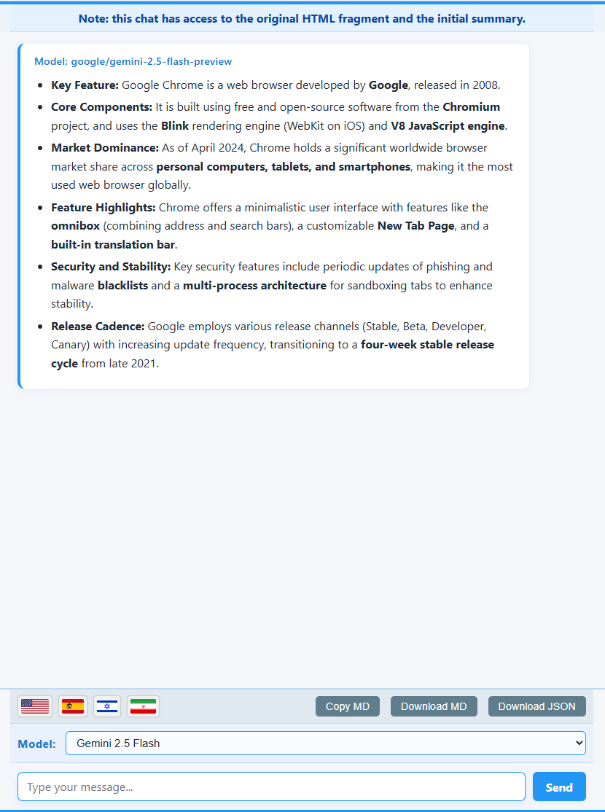

# OpenRouter Summarizer v3.0.2

**Summarize any web page content and chat with the context using OpenRouter.ai APIs**
_Featuring interactive chat, reliable HTML summaries, flexible options, and chat export!_

---

## ✨ What's New Since Version 2.0

*   Slightly changed the prompt in chat to stop LLMs responding using bullet points.
*   Allowing for incorrect output of LLAMA4-scout model.
*   Almost fixed obsessive tranlation to English bug.
*   Modified initial summary request prompt to ask for summary in the original text's language instead of the first configured language. (v2.50.7)
*   Updated summary popup UI: Moved language flags to the footer as buttons, grouped with a default chat icon button under a centered "CHAT" label. (v2.50.6)
*   Major update, may require options reset.
*   Updated `options.js` to populate the language list with default languages (English, Spanish, Hebrew, Mandarin Chinese) if it is empty on startup or the last language is deleted by the user.
*   Centralized LLM API calls in `background.js` for both summary and chat functionalities, simplifying content script logic.
*   Now you can stop a chat request by clicking the "Stop" button.
*   Changed the logic for languages: Now the user can set their own languages, with flags, and fast lookup!
*   The first language is the default for summaries. Others show up in the popup header, can be clicked.
*   Languages can now be reordered by dragging them in the Options list.

---

## 🚀 Features

*   **Summarize Anything:** `ALT+hover` to highlight, then `ALT+Click` any element on a web page to select and summarize it.
*   **Interactive Chat:** Engage in follow-up conversations with the LLM based on the summarized content and the original HTML snippet (context is now persistent!).
*   **Rich Formatting:**
    *   Initial summaries are rendered in the popup as a clean HTML list (`<ul><li>...</ul>`).
    *   Chat responses support both full Markdown formatting via `marked` and basic HTML (`<b>`).
*   **Flexible Model Selection:** Choose from a default list or add/edit any OpenRouter-compatible model ID in the Options. Your selection syncs across sessions. Supports `:nitro`, `:floor` and `:auto`.
*   **Configurable Languages for Chat Flags:** Manage a list of preferred languages in the Options. Corresponding flag icons will appear on the summary popup. Clicking a flag initiates a chat session requesting translation of the summary into that language.
*   **Languages can now be reordered** by dragging them in the Options list.
*   **Customizable Prompt:** Modify the core formatting instructions sent to the LLM via the Advanced Options section.
*   **Configurable Summary:** Choose the approximate number of summary points (3-8) for the initial summary prompt.
*   **Keyboard Shortcuts:** Use `Ctrl+Enter` / `Cmd+Enter` to send messages in the chat window.
*   **Instant Results:** Summaries appear in a clean popup; chat happens in a dedicated tab.
*   **Secure & Private:** Your API key and options are stored locally in your browser storage. Chat context is stored temporarily in session storage. Nothing is sent anywhere except OpenRouter.ai when you request a summary or chat response.
*   **Debug-Friendly:** Enable debug mode in Options for detailed console logging. The API key is filtered from the debug console messages.

---

## Screenshots




---

## 🛠️ How It Works

1.  **Install & Setup:**
    *   Install the extension.
    *   The Options page opens on first install. Enter your [OpenRouter.ai API Key](https://openrouter.ai/keys).
    *   Review default models/languages/settings. **Save Options**.
2.  **Select Content:**
    *   On any webpage, hold <kbd>ALT</kbd> + Hover to preview highlightable elements (blue dashed outline).
    *   <kbd>ALT</kbd>+Click an element to select it (red solid outline). A floating icon (💡) appears.
3.  **Summarize:**
    *   Click the floating icon (💡), *or* right-click and choose "Send to LLM", *or* click the extension toolbar icon.
    *   The extension sends the element's HTML and your configured prompt (requesting a JSON array of HTML strings) to the selected OpenRouter model. The initial summary is now generated in the **first configured language**.
4.  **Review Summary:**
    *   The summary (received as a JSON array of strings) is parsed and appears in the popup, rendered as a clean HTML list (`<ul><li>...</ul>`). Potential code fences (``````json ... ``````) around the JSON are automatically stripped. LLM responses containing multiple JSON arrays or trailing text are handled more robustly.
    *   **Click the "Chat" button to open the chat tab.**
    *   Use **Copy** or **Close**.
5.  **Chat (Optional):**
    *   Click **Chat** on the summary popup to chat about the summary.
    *   A new browser tab opens. An info banner confirms context is available.
    *   The original HTML snippet and the raw/processed JSON string are stored. For *every* message you send, the original HTML snippet is automatically prepended to the recent chat history before sending to the LLM for context.
    *   **Language flags are now available in the chat interface.** Click a flag to request a translation of the *last assistant message* into that language.
    *   Type follow-up questions. Use `Ctrl+Enter` / `Cmd+Enter` to send.
    *   LLM responses are rendered with via basic HTML (`<b>`/`<i>`) but full markdown is recognized via the `marked` library.
    *   Use **Copy MD**, **Download MD**, or **Download JSON** to save the chat.

---

## 🔒 Privacy & Permissions

*   **Permissions Used:**
    *   `activeTab`, `scripting`: To interact with the page for selection and UI.
    *   `contextMenus`: For the right-click menu option.
    *   `storage`: To save API key/preferences (`sync`) and temporary chat context (`session`).
    *   `<all_urls>`: To allow selection on any website.
    *   **`web_accessible_resources`**: Used for accessing static assets (icons, flags, JS libraries like `marked.min.js`) and dynamically imported content script modules (`highlighter.js`, `floatingIcon.js`, `summaryPopup.js`, `constants.js`) from content scripts/pages.
*   **Your Data:**
    *   **API Key & Settings:** Stored locally in `chrome.storage.sync`. Only sent to OpenRouter.ai upon request. Prompt templates and your configured language list are also stored here.
    *   **Selected HTML & Summary:** Sent to OpenRouter.ai for summary/chat requests.
    *   **Chat Context:** Original HTML snippet and raw/processed JSON string stored temporarily in `chrome.storage.session` for the chat tab. Cleared when the browser session ends. The HTML snippet is re-sent with subsequent chat messages for context.
    *   **No Analytics:** No tracking or ads.
*   **Security:**
    *   Renders HTML list/Markdown. Does **not** execute scripts or load external resources from LLM responses. Relies on `marked` for chat rendering. Static assets like SVGs and dynamically imported JS modules are loaded securely from within the extension bundle via `chrome.runtime.getURL`.

**Q: Why aren't all my configured flags showing in the popup?**
A: The flags have been moved to the chat interface for better organization and to avoid cluttering the summary popup.

**Q: How are flags chosen for languages?**
A: The extension attempts to use an SVG flag file (`[language_code].svg`) from the `country-flags/svg/` directory based on the <a href="https://en.wikipedia.org/wiki/ISO_639-1" target="_blank">ISO 639-1</a> code associated with that language in the `languages.json` file. If a flag file for a specific language code is not available in the extension bundle, a generic placeholder flag will be displayed.

---

## Technical updates

*   **Options Page Reload:** The options page now reloads automatically after saving settings to ensure all changes are fully applied and the UI is consistent.
*   **Flags Moved to Chat:** Language flags are now displayed in the chat interface instead of the summary popup footer.
*   **Simplified Summary Popup:** The summary popup footer now contains only "Copy", "Chat", and "Close" buttons. The "Chat" button initiates the chat tab with the summary context.
*   **Chat Translation Feature:** Added functionality to translate the last assistant message in the chat by clicking a language flag button.
*   **Improved Summary Popup UI:**
    *   Redesigned the footer with language flags as buttons and a central "CHAT" button.
    *   Enhanced flag visibility with a light gray background.
    *   Fixed flag positioning.
*   **Smarter Summaries:**
    *   Initial summaries are now requested in the original text's language.
    *   Fixed a bug preventing the correct summary model from being passed to and shown in the chat context.
*   **Robust Summary/Chat Parsing:**
    *   Improved logic to reliably parse LLM responses, correctly handling summaries or chat messages containing multiple or embedded JSON arrays, even without code fences.
    *   Structured JSON array output (5 items) is now requested from the LLM.
*   **Enhanced Chat Functionality:**
    *   Implemented a "Stop" button to cancel ongoing chat requests.
    *   Fixed issues with the Stop button remaining visible or error messages persisting incorrectly.
    *   Resolved bugs related to chat submission (Send button and Ctrl+Enter).
    *   Fixed `TypeError` related to language selection (`chatTargetLanguage`).
    *   Ensured clicking language flags correctly initiates translation requests in the chat.
    *   Improved chat UI rendering for better message display and consistency.
    *   Assistant responses containing JSON arrays are now rendered as structured HTML lists.
    *   Fixed parsing of the initial summary context when opening the chat.

## Core Improvements & Fixes

*   **Refactored Codebase:**
    *   Major refactoring of the content script (`pageInteraction.js`) into distinct modules (`highlighter.js`, `floatingIcon.js`, `summaryPopup.js`) for better organization.
    *   Standardized version/update headers added to JS files.
*   **Centralized Settings:**
    *   Settings management is now handled centrally by `background.js`, improving consistency and simplifying access for other components.
*   **Improved Error Handling:**
    *   Better handling and logging for errors when communicating with closed tabs or channels (e.g., "message channel closed", "Receiving end does not exist").
    *   Fixed issues where immediate validation errors (like missing API key) weren't shown correctly in the summary popup.
    *   Enhanced validation for API keys, models, and language lists in `background.js`.
*   **Enhanced Debugging:**
    *   Added more detailed debug logging (e.g., for API key retrieval, full LLM responses, health checks) while removing debug info from the user-facing popup UI.
    *   Improved log consistency and API key sanitization.
*   **Options Page Improvements:**
    *   Fixed saving/loading of custom model lists (including labels).
    *   Ensured the UI updates correctly after resetting options to default.
    *   Added post-save verification to check data integrity.
    *   Prevented settings from being saved prematurely during language selection.
    *   Fixed issues related to language data loading.
*   **Language Handling:**
    *   Standardized internal property naming (`language_info`), simplified language data structures, and fixed issues with language data availability during initialization.
*   **Version Consistency:**
    *   Updated version numbers across all relevant files (targeting v2.30, v2.31, and later up to ~v2.50.13 implicitly).

---

## 🏷️ Tags

`Summarizer`, `LLM`, `OpenRouter`, `AI`, `Chat`, `JSON`, `HTML`, `Markdown`, `Chrome Extension`, `Productivity`, `GPT`, `Claude`, `Llama`, `Gemini`, `Article Summarizer`, `Web Clipper`, `Prompt Engineering`, `Translation`, `Language Flags`
